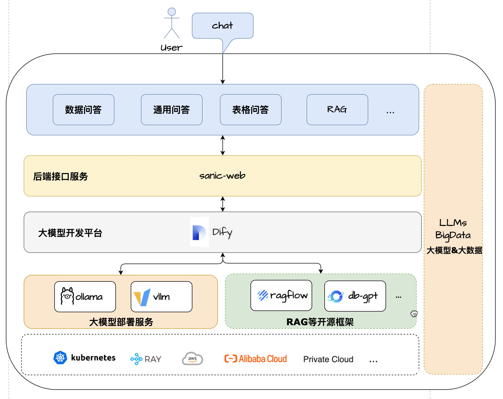
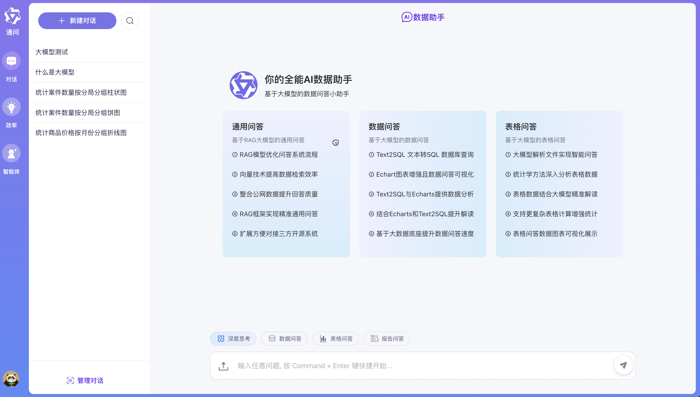
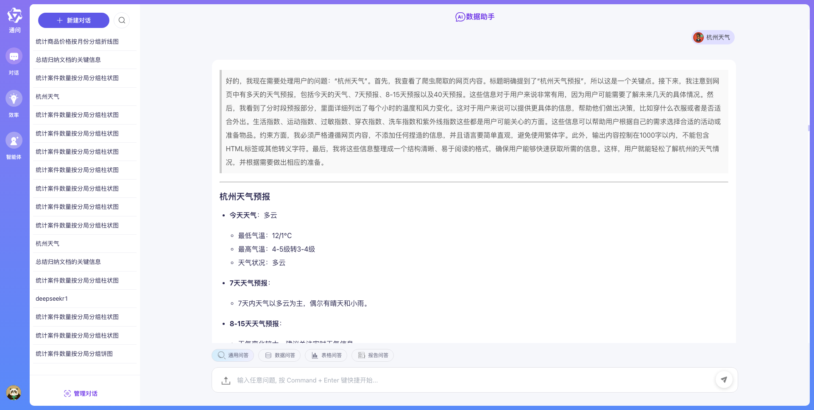

# Large Model Data Assistant

[](README.md)

🌟 **Project Introduction**

A lightweight, full - link supported, and easily customizable large model application project.

**Compatible with large models such as DeepSeek and Qwen2.5**

This is a one - stop large model application development project built on technologies like Dify, Ollama & Vllm, Sanic, and Text2SQL 📊. It features a modern UI crafted with Vue3, TypeScript, and Vite 5. It supports data graphical Q&A based on large models through ECharts 📈 and can handle tabular Q&A for CSV files 📂. Additionally, it can be easily integrated with third - party open - source RAG systems and retrieval systems 🌐 to support a wide range of general knowledge Q&A.

As a lightweight large model application development project, Sanic - Web 🛠️ supports rapid iteration and expansion, facilitating the quick implementation of large model projects. 🚀

## Architecture Diagram


## 🎉 **Features**
- **Core Technology Stack**: Dify + Ollama + RAG + (Qwen2.5/DeepSeek) + Text2SQL
- **UI Framework**: Vue 3 + TypeScript + Vite 5
- **Data Q&A**: Integrates ECharts and large models to achieve lightweight graphical data Q&A display via Text2SQL.
- **Table Q&A**: Supports uploading CSV files and provides table data Q&A based on large model summarization, preprocessing, and Text2SQL.
- **General Q&A**: Supports general data Q&A through integration with third - party RAG systems and public network retrieval.
- **Application Architecture**: Serves as a lightweight, full - link, one - stop large model application development framework for easy expansion and implementation.
- **Flexible Deployment**: Supports one - click deployment of all dependent components for large model application development using docker - compose, with zero configuration required.

## Demo





## 💡 Environment Requirements

Before you start, make sure your development environment meets the following minimum requirements:

- **Operating System**: Windows 10/11, macOS M series, Centos/Ubuntu
- **GPU**: For local deployment with Ollama, an NVIDIA GPU is recommended. Alternatively, you can use the CPU mode or purchase an API key from the public network.
- **Memory**: 8GB+

## 🔧 **Prerequisites**
* Python 3.8+
* Poetry 1.8.3+
* Dify 0.7.1+
* Mysql 8.0+
* Node.js 18.12.x+
* Pnpm 9.x

## 📚 **Large Model Deployment**
- [Refer to Ollama Deployment](https://qwen.readthedocs.io/en/latest/run_locally/ollama.html)
- Models: Qwen2.5 7B model
- Models: DeepSeek R1 7B model
- [Alibaba Cloud Public Network API Key](http://aliyun.com/product/bailian)

## ⚙️ **Dify Environment Configuration**
1. **Install Dify**
   - [Official Documentation](https://docs.dify.ai/en)
   - To assist those new to large model applications, this project provides a one - click solution to start the Dify service for a quick experience.
   - Local access address for Dify: http://localhost:18000. You need to register your own account and password.
   ```bash
   # Start the built - in Dify service
   cd docker/dify/docker
   docker - compose up -d

2. **Configure Dify**
- Add the Ollama large model provider in Dify and configure the Qwen2.5 and DeepSeek R1 models.
- Import the docker/dify/数据问答_v1.1.2_deepseek.yml canvas from the project root directory.
- Copy the API key corresponding to the canvas for use in the following steps.
- After importing the canvas, manually select the locally configured large model and save the settings.
  


## 🚀 Quick Start
The specific steps are as follows:

1. Clone the repository
```bash
git clone https://github.com/apconw/sanic - web.git
```

2. Start the service

- Modify the environment variables starting with DIFY_ in the chat - service of docker - compose.
- Set the DIFY_DATABASE_QA_API_KEY to the API key obtained from the Dify canvas.

```bash
# Start the front - end, back - end services, and middleware
cd docker
docker compose up -d
```
3. Configure Minio
   
- Access the MinIO service at http://localhost:19001/. The default account is admin, and the password is 12345678.
- Create a bucket named filedata and configure the Access Key.
- Modify the environment variables starting with MINIO_ in the chat - service of docker - compose and restart the service.

```bash
# Restart the front - end, back - end services, and middleware
cd docker
docker compose up -d
```

4. Initialize the data

```bash
# Install the dependency package
pip install pymysql

# For Mac or Linux users
cd docker
./init.sh

# For Windows users
cd common
python initialize_mysql.py
```

5. Access the application
- Front - end service: http://localhost:8081


## 🛠️ Local Development
- Clone the repository
- Deploy large models: Refer to the above Large Model Deployment section to install Ollama and deploy the Qwen2.5 and DeepSeek R1 models.
- Configure Dify: Refer to the above Dify Environment Configuration section to obtain the API key from the Dify canvas and modify the DIFY_DATABASE_QA_API_KEY in the .env.dev file.
- Configure Minio: Modify the Minio - related keys in the .env.dev file.
- Install dependencies and start the services

1. **Back - end dependencies**
- Install Poetry: [Refer to the official Poetry documentation](https://python - poetry.org/docs/)

```bash
# Install Poetry
pip install poetry

# Install dependencies at the root directory
# Set up the domestic mirror
poetry source add --priority = primary mirrors https://pypi.tuna.tsinghua.edu.cn/simple/
poetry install --no - root
```

2. **Install middleware**
```bash 
cd docker
docker compose up -d mysql minio
```
3. **Configure Minio**
- Access the MinIO service at http://localhost:19001/. The default account is admin, and the password is 12345678.
- Create a bucket named filedata and configure the Access Key.
- Modify the Minio - related keys in the .env.dev file.

4. **Initialize the data**
- If you are using a local MySQL environment, you need to modify the database connection information in the initialize_mysql source code.
```bash
# For Mac or Linux users
cd docker
./init.sh

# For Windows users
cd common
python initialize_mysql.py
```

5. **Front - end dependencies**
- The front - end is based on the open - source project [chatgpt - vue3 - light - mvp](https://github.com/pdsuwwz/chatgpt - vue3 - light - mvp).

```bash 
# Install front - end dependencies and start the service
cd web

# Install pnpm globally
npm install -g pnpm

# Install dependencies
pnpm i

# Start the service
pnpm dev
```

6. **Start the back - end service**
```bash
# Start the back - end service
python serv.py
```

7. **Access the service**
- Front - end service: http://localhost:2048

## 🐳 Build Images
- Execute the following commands to build the images:
```bash
# Build the front - end image
make web - build

# Build the back - end image
make server - build
```

## 🌹 Support
If you find this project useful, please give it a star on GitHub by clicking the [`Star`](https://github.com/apconw/sanic-web)  button. Your support is our motivation to keep improving. Thank you! ^_^


## ⭐ Star History
 [](https://star-history.com/#apconw/sanic-web&Date)


## QA Community
- Join our large model application community to discuss and share experiences.
- Follow the official WeChat account and click the "WeChat Group" menu to join.

|               微信群                |
| :---------------------------------: |
|  |


## License
MIT License | Copyright © 2024 - PRESENT AiAdventurer