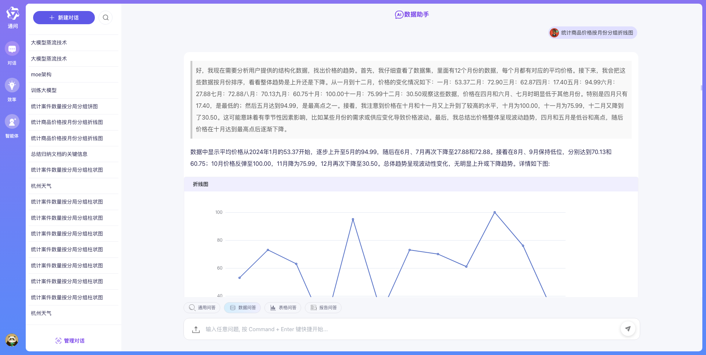

# 大模型数据助手
[](README-en.md)

🌟 **项目简介**

一个轻量级、支持全链路且易于二次开发的大模型应用项目 

**已适配DeepSeek/Qwen2.5等大模型**

基于 Dify 、Ollama&Vllm、Sanic 和 Text2SQL 📊 等技术构建的一站式大模型应用开发项目，采用 Vue3、TypeScript 和 Vite 5 打造现代UI。它支持通过 ECharts 📈 实现基于大模型的数据图形化问答，具备处理 CSV 文件 📂 表格问答的能力。同时，能方便对接第三方开源 RAG 系统 检索系统 🌐等，以支持广泛的通用知识问答。

作为轻量级的大模型应用开发项目，Sanic-Web 🛠️ 支持快速迭代与扩展，助力大模型项目快速落地。🚀

## 架构方案


## 🎉 **特性**
- **核心技术栈**：Dify + Ollama + RAG + (Qwen2.5/DeepSeek) + Text2SQL
- **UI 框架**：Vue 3 + TypeScript + Vite 5
- **数据问答**：集成 ECharts大模型实现Text2SQL轻量级的图形化数据问答展示
- **表格问答**：支持 CSV格式文件的上传与基于大模型总结预处理和Text2SQL的表格数据问答
- **通用问答**：支持通用数据形式问答基于对接三方RAG系统+公网检索模式
- **应用架构**：作为一个轻量级全链路一站式大模型应用开发框架方便扩展落地
- **灵活部署**：支持大模型应用开发各依赖组件docker-compose一键拉起快速部署零配置

## 运行效果





## 💡环境配置要求

在开始之前，请确保您的开发环境满足以下最低配置要求：

- **操作系统**：Windows 10/11, macOs M系列, Centos/Ubuntu
- **GPU**: 本地使用ollama部署，推荐使用Nvidia显卡或CPU模式。或公网购买APIKEY形式
- **内存**：8GB+

## 🔧 **前置条件**
* Python 3.8+
* Poetry 1.8.3+
* Dify 0.7.1+
* Mysql 8.0+
* Node.js 18.12.x+
* Pnpm 9.x


## 📚 **大模型部署**
- [参考Ollama部署](https://qwen.readthedocs.io/zh-cn/latest/run_locally/ollama.html)
- 模型: Qwen2.5 7B 模型
- 模型: DeepSeek R1 7B 模型
- [阿里云公网APIKEY形式](http://aliyun.com/product/bailian)

## ⚙️ **Dify环境配置**
1. **安装Dify**
   - [官方参考文档](https://docs.dify.ai/zh-hans)
   - 为了兼顾第一次接触大模型应用的同学，本项目提供了一键拉起Dify服务方便大家快速体验。
   - Dify本机访问地址：http://localhost:18000 账号/密码: 需自己注册 
   ```bash
   # 拉起内置的dify服务
   cd docker/dify/docker
   docker-compose up -d
   
2. **Dify配置**
   - 添加Dify大模型提供商Ollama,配置Qwen2.5模型和DeepSeek R1模型
   - 导入项目根目录下的**docker/dify/数据问答_v1.1.2_deepseek.yml画布** 
   - 获取画布对应的api-key先复制出来下面步骤会使用
   - 导入画布后需要手动选择一下你本地配置的大模型并保存


   
## 🚀 **快速体验**
   - 具体步骤如下：
   - 第一步克隆代码到本地
   - 第二步参考上面**大模型部署**先安装Ollama部署Qwen2.5模型和DeepSeek R1模型
   - 第三步Dify环境配置直接参考上面**Dify环境配置** **这步很重要!!!!**
   - 第四步启动服务具体步骤如下:

1. **克隆仓库**
   ```bash
   git clone https://github.com/apconw/sanic-web.git

2. **启动服务**
   - 修改docker-compose里的chat-service服务DIFY_开头的环境变量
   - 修改**DIFY_DATABASE_QA_API_KEY** 获取Dify画布的api-key

   ```bash
   # 拉起前后端服务和中间件
   cd docker
   docker compose up -d
   
3. **Minio配置**
   - 访问MinIO服务，http://localhost:19001/ 账号:admin 密码:12345678
   - 创建一个bucket，名称filedata，同时配置Access Key
   - 修改docker-compose里的chat-service服务的MINIO_开头的环境变量重启服务

   ```bash
   # 重新拉起前后端服务和中间件
   cd docker
   docker compose up -d

4. **数据初始化**
   ```bash
   
   # 安装依赖包
   pip install pymysql
   
   # Mac or Linux 用户执行
   
   cd docker
   ./init_data.sh
   
   # Windows 用户执行
   
   cd common
   python initialize_mysql.py
   
   
   
5. **访问服务**
 - 前端服务：http://localhost:8081


## 🛠️ **本地开发**
- 第一步克隆代码到本地
- 第二步参考上面**大模型部署**先安装Ollama部署Qwen2.5模型和DeepSeek R1模型
- 第三步本地开发环境Dify配置，参考上面 **Dify环境配置里 获取Dify画布的api-key 同时修改.env.dev文件里面的DIFY_DATABASE_QA_API_KEY**
- 第四步本地开发环境Minio配置,修改env.dev文件里面的Minio相关密钥信息
- 第五步安装前后端项目依赖并启动前后端服务具体步骤如下:

1. **后端依赖安装**  
   - poetry安装 [参考poetry官方文档](https://python-poetry.org/docs/)
   ```bash
   # 安装poetry
   pip install poetry
   
   # 安装依赖根目录执行
   # 设置国内仓库
   poetry source add --priority=primary mirrors https://pypi.tuna.tsinghua.edu.cn/simple/
   poetry install --no-root

2. **安装中间件**
   ```bash
   cd docker
   docker compose up -d mysql minio
   
3. **Minio配置**
   - 访问MinIO服务，http://localhost:19001/ 账号:admin 密码:12345678
   - 创建一个bucket，名称filedata，同时配置Access Key
   - 修改.evn.dev里的MINIO_开头的密钥消息
   
4. **初始化数据库**
   - 如果使用本地环境mysql,初始化数据时需修改源码initialize_mysql，修改数据库连接信息即可
   ```bash
    # Mac or Linux 用户执行
     cd docker
     ./init_data.sh
      
    # Windows 用户执行
      
     cd common
     python initialize_mysql.py

5. **前端依赖安装**  
   - 前端是基于开源项目[可参考chatgpt-vue3-light-mvp安装](https://github.com/pdsuwwz/chatgpt-vue3-light-mvp)二开
   ```bash
   # 安装前端依赖&启动服务
   cd web
   
   #安装依赖
   npm install -g pnpm

   pnpm i
   
   #启动服务
   pnpm dev
   
6. **启动后端服务**
   ```bash
   #启动后端服务
   python serv.py
   ```

7. **访问服务**
 - 前端服务：http://localhost:2048

## 🐳 构建镜像

- 执行构建命令：
   ```bash
   # 构建前端镜像 
   make web-build
  
   # 构建后端镜像
   make server-build


## 🌹 支持

如果你喜欢这个项目或发现有用，可以点右上角 [`Star`](https://github.com/apconw/sanic-web) 支持一下，你的支持是我们不断改进的动力，感谢！ ^_^

## ⭐ Star History
 [](https://star-history.com/#apconw/sanic-web&Date)

## 🐳 关于技术支持申明
- **开源不易,本人精力和时间有限，如需一对一技术支持可以赞助一波^_^联系微信(备注 技术支持)**
- **一对一技术支持 我将亲自远程帮您配置开发环境部署和启动、并讲解项目架构以及二开思路等**
- **长期技术支持方式 拉你加入群(一线算法、架构大佬群)，为你提供技术指导，项目解决方案等**

## QA交流群
- 大模型应用交流群欢迎大家, 欢迎加进群讨论分享经验
- 关注下面的公众号点击·**微信群**菜单添加微信拉你入群

|                 微信群                 |
|:-----------------------------------:|
|  | 

## License

[MIT](./LICENSE) License | Copyright © 2024-PRESENT [AiAdventurer](https://github.com/apconw)